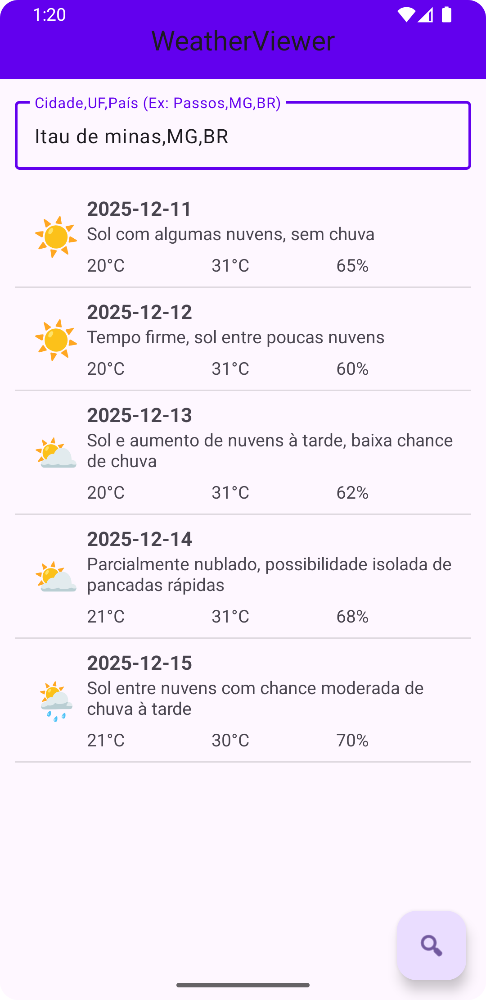

# 🌦️ WeatherViewer - Consumo de API

**👨‍💻 Aluno:** Liniker Silva  
**🎓 Curso:** Sistemas de Informação  
**📚 Disciplina:** Programação III (2025/02)  
**🏫 Instituição:** UEMG - Unidade Passos  

---

## 📝 Descrição do Projeto

Este é um aplicativo **Android nativo** desenvolvido como Trabalho Prático para a disciplina de Programação III. O objetivo foi criar um cliente para consumo de **Web Service REST**, aplicando conceitos de processamento de dados JSON, Threads Assíncronas e construção de interface gráfica.

O projeto é uma adaptação prática do "WeatherViewer App" (Capítulo 7 do livro *Android for Programmers*), modificado para consumir a **API personalizada da UEMG** hospedada na AWS.

---

## ✨ Funcionalidades

* 🔍 **Consulta de Cidade:** Entrada de texto para busca (ex: `Passos, MG, BR`).
* 📡 **Conexão HTTP:** Uso da classe `HttpURLConnection` para buscar dados brutos.
* 🔄 **Processamento JSON:** Tratamento da resposta da API para extrair temperaturas e descrições.
* 🧵 **AsyncTasks:** Execução de tarefas de rede em segundo plano para não travar a interface.
* 📱 **Lista Personalizada:** Exibição da previsão de 7 dias com datas, ícones (emojis), temperatura e umidade.

---

## 🚀 Como Executar o Projeto

1.  **Clone este repositório** em sua máquina:
    ```bash
    git clone https://github.com/linskrs/Prog3-WeatherViewer.git
    ```
2.  Abra o **Android Studio** e selecione "Open an Existing Project".
3.  Navegue até a pasta clonada e clique em **OK**.
4.  Aguarde o **Gradle** sincronizar todas as dependências.
5.  Selecione um emulador (recomendado API 31 ou superior) e clique no botão **Run (▶️)**.

> **Nota:** Certifique-se de que o emulador possui acesso à internet.

---

## 🔗 Exemplo de URL da API

Conforme solicitado nos requisitos da entrega, abaixo está um exemplo da URL gerada pelo aplicativo para realizar a consulta:

```http
http://agent-weathermap-env-env.eba-6pzgqekp.us-east-2.elasticbeanstalk.com/api/weather?city=Itau%20de%20minas%2C%20MG%2C%20BR&days=7&APPID=AgentWeather2024_a8f3b9c1d7e2f5g6h4i9j0k1l2m3n4o5p6
```

## 📸 Captura de Tela

Abaixo, o resultado da execução do aplicativo exibindo a previsão da minha cidade, retornada pela API:

